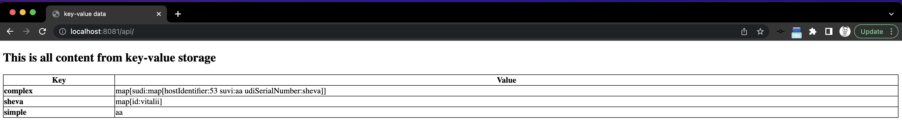

## Key-value storage
Key-value storage is a non-relational database that stores data as a collection of key-value pairs.

### Sub task1 (Simple key-value storage)

#### Description
Build a simple, non-distributed key-value storage that can support the next things:
1. It must be able to store key-value pairs.
2. It must provide API for a user to `put`, `get` and `delete` key-value pairs.
3. It must be steady and always be available for storing the data.
4. It must be idempotent.

**Note**: A good level of documentation and unit test coverage is required.

#### Something to read

* [Cloud Native](https://cloudnative101.dev/concepts/cloud-native/)
* [How to design a good API](http://www.cs.bc.edu/~muller/teaching/cs102/s06/lib/pdf/api-design) — must read
* [Why Golang?](https://thechief.io/c/editorial/why-golang-is-widely-used-in-the-devops-and-cloud-native-space/)
* [API Design](https://www.infoq.com/articles/API-Design-Joshua-Bloch/)

### Sub-task 2 (HTTP server + REST API)

Build a simple HTTP server/client for the key-value storage project.

1. Create a Go server to handle HTTP requests. (using **net/http** library)
2. Use JSON to accept requests and reply to them
3. Write a table with a specification for REST API. (see example below)

   | Functionality     | Method | URI    | Status code |
   |-------------------|--------|--------|------------ |
   | Create a user     | POST   | /users | 200         |

4. Add the next handlers to the server: **GET ALL**, **GET**, **PUT**, **DELETE**.

* **GET ALL**

- Must only match GET requests for **specific_uri** (you will have to choose the URI).
- Must respond with a 404 (Not Found) when the storage is empty.
- Must respond with all the data of key-value storage and a status 200 (Ok).
- Must respond to unexpected errors with a 500 (Internal Server Error).

* **GET**

- Must only match GET requests for **specific_uri** (you will have to choose the URI).
- Must respond with a 404 (Not Found) when a requested key does not exist.
- Must respond with the requested value and a status 200 (Ok) if the key exists.
- Must respond to unexpected errors with a 500 (Internal Server Error).

* **PUT**

- Must only match PUT requests for **specific_uri** (you will have to choose the URI).
- Must respond with a 201 (Created) when a key-value pair is created.
- Must respond to unexpected errors with a 500 (Internal Server Error).

* **DELETE**

- Must only match DELETE requests for **specific_uri** (you will have to choose the URI).
- Must respond with a status 200 (Ok) indicating a successful deletion with additional information. In this case, the response
  body can contain the deleted resource or some details about the deletion.
- Must respond with a status 204 (No content) indicating a successful deletion with no additional information (response body is
  empty).
- Must respond with a status 202 (Accepted) is returned if the server accepted the request, but the deletion has not been
  completed.
- Must respond with a 404 (Not found) if no resource exists at the given URI.

**Note**: A good level of documentation and unit test coverage is required.

#### Something to read

* [TCP/IP](https://www.objc.io/issues/10-syncing-data/ip-tcp-http/) — must read
* [TCP Technical overview](https://medium.com/@jimmyclem/a-technical-overview-of-tcp-pt-1-62e777c0d01)
* [Data serialization](https://towardsdatascience.com/what-why-and-how-of-de-serialization-in-python-2d4c3b622f6b)
* [Data serialization formats](https://study-ccna.com/data-serialization-formats-json-yaml-xml/)
* [URL & URI](https://danielmiessler.com/study/difference-between-uri-url/)
* [GoLang & JSON](https://gobyexample.com/json)

### Sub-task 4 (Go templates)

The HTTP server should have a REST API, which will return all data from the key-value storage as HTML page.  
The html page should show all key pairs as html table or divs with CSS styles.  
If the key-value storage is empty, an appropriate message should be shown to a user.

**Hint**: two packages are operating with templates in Go — **text/template** and **html/template**. Both provide the same
interface, however, the **html/template** package is used to generate HTML output safe against code injection.

#### Some examples of output




Info on Go templates:

* [A quick overview of go templates](https://betterprogramming.pub/how-to-use-templates-in-golang-46194c677c7d):
  read and execute code snippets in the article, play with them to learn the API.
* Read [Full spec of go template package](https://pkg.go.dev/text/template).

### Sub-task 5 (Concurrency)

Add client package which is capable of connecting to the server and initiating requests.

Add client benchmark tests.  
Two tests: one which is adding records to the server sequentially, another one which runs requests concurrently using goroutines.

- initiate client requests to the server to put some records on it
- wait when all requests are finished (tip: `sync.WaitGroup` can be used)
- get all records from the server and assert they are equal to the input data
- use benchmark ability of go `testing` lib to output performance results
- be able to provide the number of requests on the command line when running requests to get performance results for different
  number of requests
- attach benchmarking results to the PR with number of requests equal to 10 and 50 for both sequential and concurrent types of
  tests.

In Go maps are not concurrently-safe, so when you run the above concurrent test you'll see some unexpected results. After running
the tests against the simple server improve it to be concurrently-safe and run the tests again.
Use [this article](https://medium.com/@luanrubensf/concurrent-map-access-in-go-a6a733c5ffd1) to help you in the implementation.

Info on Go concurrency:

* [Why go concurrency is great?](https://www.slideshare.net/jsimnz/concurrency-with-go) - an overview
* [Concurrency patterns](https://talks.golang.org/2012/concurrency.slide#1) - read carefully, execute code snippets

### Sub-task 6 (Transaction Logger)

If the key-value service was crashed/restarted or found itself in an inconsistent state, it should have the ability to **recover**
the system. The requirement here is to use **go channels*.

**Hint**:

* log **PUT** and **DELETE** actions as entries in the file.
* at the start of the server, if the file is present -> start a goroutine to load entries into the memory and send them to a
  channel.
* the channel is used by another function to receive entries and make API requests to the key-value storage to restore these
  records into the storage.

### Sub-task 7 (HTTPS server)

HTTP data between server and client is not encrypted, so it can be intercepted by third parties to gather data passed from the
server to the client. This can be addressed by using a secure version called HTTPS. **The key-value storage server has to become
HTTPS instead of HTTP.**
Small hint: **net/http** library allows to achieve that.

### Sub-task 8 (Logging)
The key-value storage server should have the ability for troubleshooting some issues/bugs and for identifying infrastructure problems.
This can be achieved using logging functionality, Go provides a library that helps easily integrate this to your application. The library name is **log**.

### Sub-task 9 (Containerization)
#### Pre requirements
1. Install **Docker desktop**

#### Description
The key-value storage server should be containerized in a Docker container. The result of this task should be a docker image, which everyone can run locally
and show the key-value storage works as expected.

### Sub-task 10 (Build tool)
At this point, there are too many tasks that we have to run manually every time we want to do some action,
such as `go build`, `go test`, `docker run`, `docker build`, etc. A build tool (Gradle) helps to automate tasks that
we would otherwise have to manually perform or "manually automate".

In the scope of this task, the next Gradle commands have to be implemented:
1. `dockerBuild` — runs `docker build` command
2. `publish` — runs `docker push` command
3. `tests` — runs `go tests` and `go lint` commands

### Sub-task 11 (CI build)
Continuous Integration (CI) is a way to increase code quality without putting an extra burden on the developers.
Tests and checks of your code are handled on a server and automatically reported back to you.
The project has to have the ability to support CI. In the scope of this task, you will have to do next:
1. Implement a project’s entire pipeline in a **Jenkinsfile**. It should allow running **unit tests** and send an error with a description of what's failed.
2. Configure a project in GitHub to run CI for every PR you created.

### Sub-task 12 (Kubernetes getting started)
#### Pre requirements
1. Install **kubectl**, **Lens**

#### Exercises for getting familiar with Kubernetes world
1. Exercise creating clusters in **Docker desktop**
2. Exercise deploying **hello-world** image in Kubernetes

#### Description of the task
Deploy key-value storage to Kubernetes. Needs to create a new folder in the project called `templates` and create a `Deployment` resource for the key-value storage app.
In addition to that Gradle tasks should be added:
1. `deploy` — deploys the key-value storage app on the Kubernetes cluster.
2. `undeploy` — removes the key-value storage app from the Kubernetes cluster.

### Sub-task 13 (kubebuilder)
Create a custom resource for the key-value application using kubebuilder. Implement a controller for it.
The Kubernetes Custom Resource Definition  has the following schema:
```yaml
apiVersion: teamdev.com/v1
kind: KIND

spec:
  someField: "someValue"
  someField2: "someValue2"

status:
  conditions:
  - type: "TYPE"
    
    # True or False
    status: True
    
    reason: REASON
    
    message: MESSAGE
    
    lastUpdateTime: ""
```
TODO:vishevch:fill CRD definition

### Sub-task 14 (webhooks)
The CRD should be validated properly, to achieve that custom validating_webhook for the CRD should be implemented.

#### Validation rules:
TODO:vishevch:add validation rules

### Sub-task 15 (package managers)
The application should be packaged to Helm (one of the available package managers) chart. This will helm to define, install,
and upgrade even the most complex Kubernetes application.
In addition to that the following Gradle tasks should be added:
1. `createChart` — creates a Helm chart with all needed resources for the key-value storage
3. `installChart` — installs chart on Kubernetes cluster
4. `uninstallChart` — uninstalls chart from Kubernetes cluster

### Sub-task 16 (improve CI build)
At this point, the CI can be improved and can be smarter. It should be able to do next:
1. Run unit tests (functionality from the Sub task10).
2. Create docker image for the key-value storage app.
3. Push the docker image to the docker artifactory.
4. Create a helm chart for the key-value storage app.
5. Send an email that the chart was generated successfully, add the code coverage and attach the helm chart to the email.


## IMPORTANT FOR EACH SUBTASK
#### A good level of documentation and unit test coverage is required.
